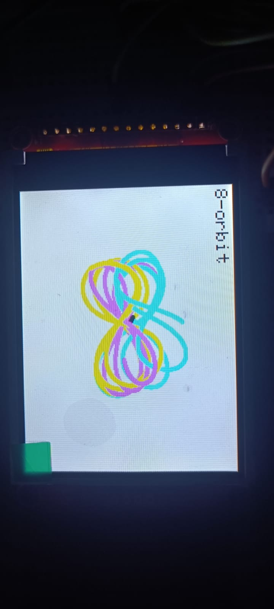
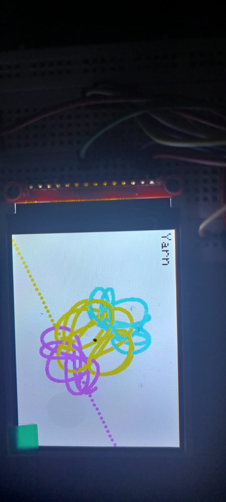

#  Three-Body Problem Simulation

A real-time **Three-Body Problem Simulator** built on the **Arduino Uno** that numerically solves Newtonian gravitational interactions using the **Leapfrog Integration** algorithm. The simulator visualizes multiple periodic three-body orbits on an **ST7789 TFT display** while demonstrating how small perturbations in mass can transform stable periodic motion into chaotic behavior.

---

## 📌 Project Highlights

*  Real-time simulation of the classical Three-Body Problem
*  Leapfrog Integration for improved numerical stability and energy conservation
*  Six predefined periodic three-body orbit configurations
*  Interactive orbit selection using push buttons
* Adjustable body mass for perturbation experiments
*  Center of Mass visualization
*  Persistent trajectory rendering
*  Fully implemented on an Arduino Uno

---

#  Hardware

## Components

* Arduino Uno
* ST7789 TFT Display (240 × 320)
* Breadboard
* 3 Push Buttons
* Resistors
* Jumper Wires

## Hardware Setup

---

# 🎮 Controls

| Button       | Function                                     |
| ------------ | -------------------------------------------- |
| **Button 1** | Switch between periodic orbit configurations |
| **Button 2** | Increase the mass of Body 1 by 0.1 units                |
| **Button 3** | Reset the simulation                         |

---

#  Numerical Method

The simulator models the gravitational interaction between three bodies governed by **Newton's Law of Universal Gravitation**.

For every simulation step:

1. Compute gravitational forces acting on each body.
2. Calculate the resulting accelerations.
3. Perform a Leapfrog Integration step.
4. Update body positions and velocities.
5. Render the new positions and trajectory trails on the TFT display.

Unlike the standard Euler method, **Leapfrog Integration** preserves energy significantly better over long simulations, making it particularly suitable for orbital mechanics.

---

# 🛰️ Periodic Orbit Gallery

## Figure-Eight Orbit

The famous figure-eight solution where three equal masses continuously follow the same closed trajectory while remaining equally spaced in time.

---

## Brucke A3

A periodic solution characterized by symmetric looping trajectories and stable orbital repetition.

---

## Brucke A11

Another stable periodic solution exhibiting unique orbital symmetry and repeating motion.

---

## Brucke A14

A higher-order periodic orbit displaying intricate path crossings while maintaining long-term stability.

---

## Loop-Ended Triangle

A periodic orbit where the bodies repeatedly trace triangular looped trajectories.

---

## Yarn Orbit

An intricate periodic orbit whose intertwined trajectory resembles woven yarn.

---

# Mass Perturbation Experiment

One of the primary objectives of this project is to demonstrate the **sensitivity of the Three-Body Problem to small parameter changes**.

The simulator allows the mass of one body to be increased while keeping the remaining bodies unchanged, enabling direct observation of how stable periodic motion transitions into chaotic dynamics.

## Stable Configuration

**Mass = [1.0, 1.0, 1.0]**

The bodies repeatedly follow a stable periodic trajectory for thousands of simulation steps while preserving the overall orbital structure.

---

## Perturbed Configuration

**Mass = [1.1, 1.0, 1.0]**

Increasing the mass of a single body disrupts the periodic solution, causing the orbit to gradually diverge into chaotic motion. This experiment illustrates the sensitive dependence on initial conditions that makes the Three-Body Problem one of the most fascinating problems in classical mechanics.

---
## Numerical Stability Demonstration

The simulator uses **Leapfrog Integration** to improve long-term energy conservation. However, close encounters between bodies still present a numerical challenge because the gravitational force increases rapidly as the distance between bodies decreases (**F ∝ 1/r²**).

To demonstrate the effect of integration step size, the simulation was tested using two different time steps.

### Large Time Step (ΔT = 0.005)

With a larger time step, the integrator cannot accurately resolve close encounters. The accumulated numerical error injects artificial energy into the system, causing unrealistic **slingshot-like trajectories** and eventual numerical instability.

---

### Reduced Time Step (ΔT = 0.001)

Reducing the time step significantly improves temporal resolution, allowing the Leapfrog Integrator to handle close gravitational interactions more accurately. The periodic orbit remains stable for much longer, delaying numerical divergence and preserving the expected orbital structure.

Although the smaller time step increases the computational workload and slows the real-time simulation, it provides a substantial improvement in numerical stability, making it better suited for long-duration orbital simulations.

#  Results

- Successfully simulated six periodic three-body solutions.
-  Achieved stable long-duration simulations using Leapfrog Integration.
-  Visualized the system's center of mass in real time.
-  Demonstrated the transition from periodic to chaotic motion through controlled mass perturbations.
-  Developed a fully interactive embedded physics simulator using Arduino Uno and an ST7789 TFT display.

---

# 🛠️ Software Stack

* C++
* Arduino IDE
* Adafruit GFX Library
* Adafruit ST7789 Library
* SPI
* math.h

---

# References

* Three-Body Problem periodic orbit datasets
* Arduino Documentation
* Adafruit ST7789 Library Documentation
