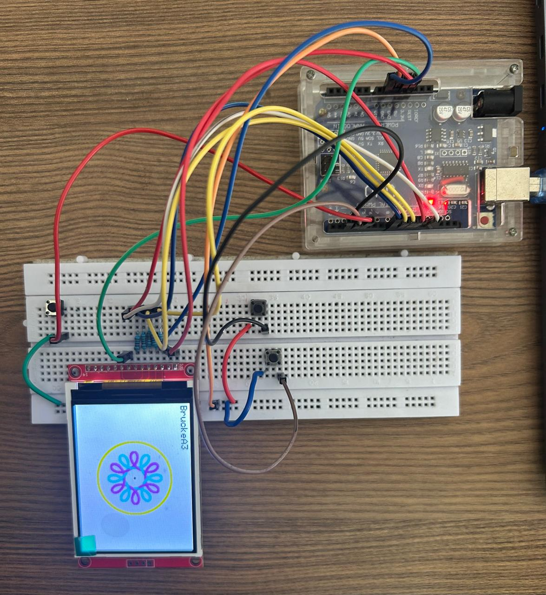
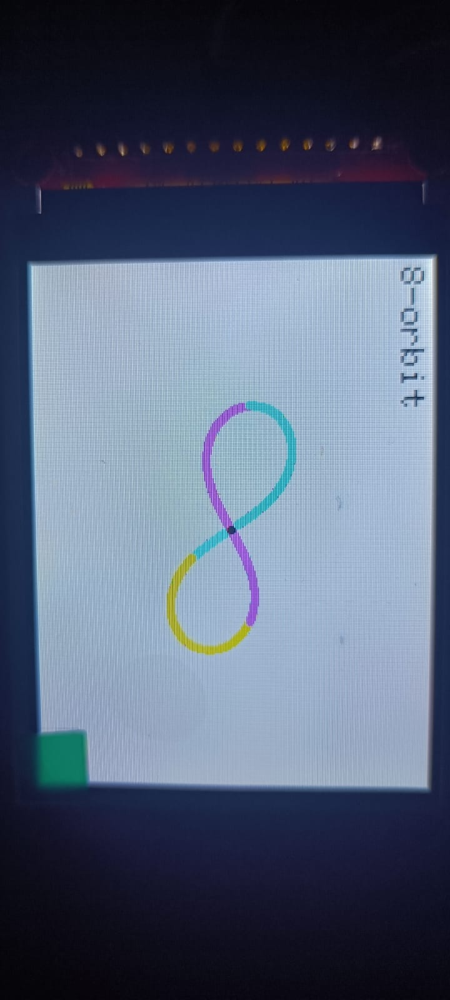
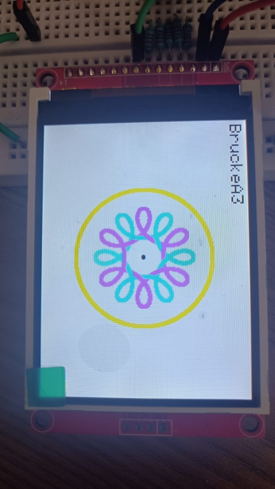
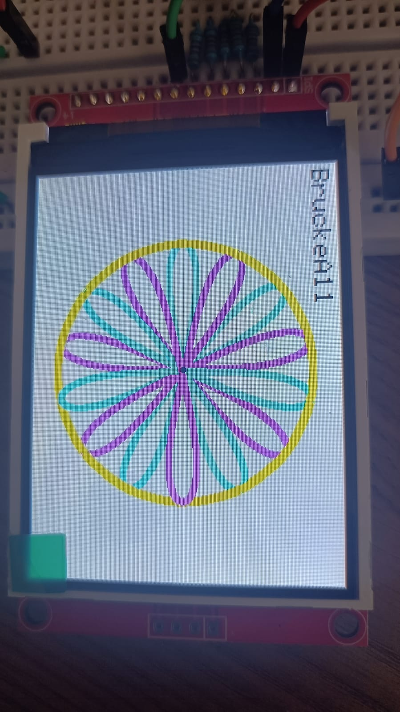
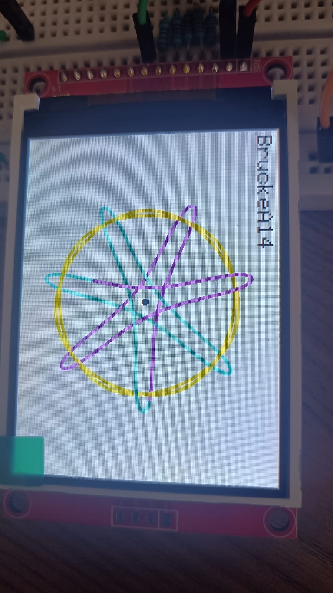
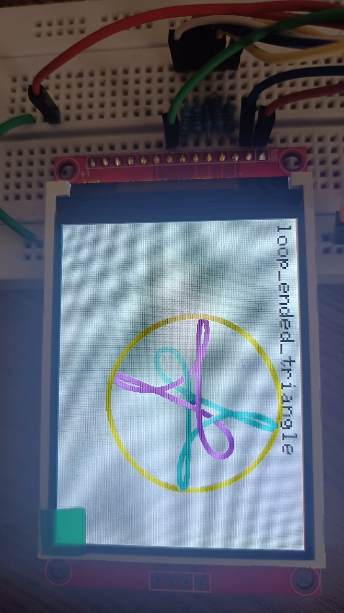
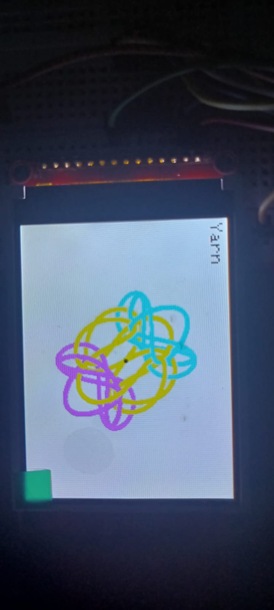

# Three-Body Problem Simulator

A real-time **Three-Body Problem** simulator implemented on an **Arduino Uno**, utilizing the **Leapfrog Integration** algorithm to numerically solve Newtonian gravitational interactions. The simulation visualizes multiple periodic three-body orbits on an **ST7789 TFT display** and demonstrates the transition from stable periodic motion to chaotic dynamics through user-controlled mass perturbations.

---

## Features

- Real-time three-body gravitational simulation
- Leapfrog Integration for stable numerical computation
- Six periodic three-body orbit configurations
- Interactive orbit selection using push buttons
- Adjustable body mass for perturbation experiments
- Center of Mass visualization
- Persistent orbit trail rendering
- Hardware implementation on Arduino Uno

---

# Hardware

### Components Used

- Arduino Uno
- ST7789 TFT Display (240 × 320)
- Breadboard
- 3 Push Buttons
- Resistors
- Jumper Wires

### Hardware Setup

---

# Controls

| Button | Function |
|---------|----------|
| Button 1 | Change Orbit |
| Button 2 | Increase Mass |
| Button 3 | Reset Simulation |

---

# Numerical Method

The simulator models Newtonian gravitational interactions between three bodies.

For every simulation step:

1. Compute gravitational forces
2. Update body accelerations
3. Perform Leapfrog Integration
4. Update body positions
5. Render trajectories on the TFT display

The Leapfrog Integrator was selected because it provides significantly better long-term energy conservation than the standard Euler method, making it well suited for orbital simulations.

---

# Gallery of Periodic Orbits

## Figure-Eight Orbit

### Demonstration

<!-- Replace the video path below -->

<video src="Videos/Eight_Orbit.mp4" controls width="450"></video>

---

## Brucke A3

### Demonstration

<video src="Videos/Brucke_A3.mp4" controls width="450"></video>

---

## Brucke A11

---

## Brucke A14

---

## Loop-Ended Triangle

---

## Yarn Orbit

---

# Mass Perturbation Experiment

One objective of this project was to demonstrate the sensitivity of periodic three-body systems to small parameter changes.

The simulator allows the mass of one body to be increased while keeping the remaining bodies unchanged.

---

## Stable Configuration

**Mass = [1.0, 1.0, 1.0]**

The system follows a stable periodic orbit over thousands of integration steps.

<video src="Videos/Eight_Orbit.mp4" controls width="450"></video>

---

## Perturbed Configuration

**Mass = [1.1, 1.0, 1.0]**

Increasing the mass of a single body destabilizes the periodic solution, causing the orbit to transition into chaotic motion.

<video src="Videos/Eight_Orbit_Mass_Perturbation.mp4" controls width="450"></video>

---

## Brucke A3 Perturbation

The same perturbation experiment was repeated for the Brucke A3 orbit.

A slight increase in mass similarly causes the periodic trajectory to deform and evolve into chaotic motion.

<video src="Videos/Brucke_A3_Mass_Perturbation.mp4" controls width="450"></video>

---

# Results

- Successfully simulated six periodic three-body solutions.
- Maintained stable orbital trajectories using Leapfrog Integration.
- Visualized the system's center of mass throughout the simulation.
- Demonstrated transition from periodic to chaotic motion through mass perturbation.
- Implemented an interactive embedded visualization using Arduino Uno and ST7789 TFT.

---

# Software Stack

- C++
- Arduino IDE
- Adafruit_GFX
- Adafruit_ST7789
- SPI
- math.h

---

# References

- Three-Body Problem periodic orbit datasets
- Arduino Documentation
- Adafruit ST7789 Library